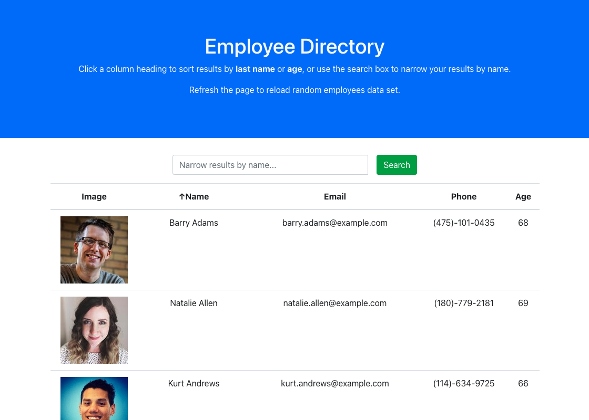

# Employee Directory
Front end React.js app that uses allows a user to easily view employee data. Users can sort by name or age, ascending or descending, and can filter results using a name search feature. The data is provided by [randomuser.me](https://randomuser.me/), a "free, open-source API for generating random user data. Like Lorem Ipsum, but for people."

## Table of Contents
- [Installation Steps](#installation)
- [Deployed Application](#deployed-application)
- [Screenshots](#screenshots)
- [Licenses](#licenses)

---
## Installation 
To run this app on your machine, Node must be installed, as well as the React, Axios, and Bootstrap.

## Deployed Application
[Deployed Application](https://dandandanoneil.github.io/employee-directory)

## Screenshots

## Licenses
### MIT License

Copyright (c) 2020 Dan O'Neil

Permission is hereby granted, free of charge, to any person obtaining a copy of this software and associated documentation files (the "Software"), to deal in the Software without restriction, including without limitation the rights to use, copy, modify, merge, publish, distribute, sublicense, and/or sell copies of the Software, and to permit persons to whom the Software is furnished to do so, subject to the following conditions:

The above copyright notice and this permission notice shall be included in all copies or substantial portions of the Software.

THE SOFTWARE IS PROVIDED "AS IS", WITHOUT WARRANTY OF ANY KIND, EXPRESS OR IMPLIED, INCLUDING BUT NOT LIMITED TO THE WARRANTIES OF MERCHANTABILITY, FITNESS FOR A PARTICULAR PURPOSE AND NONINFRINGEMENT. IN NO EVENT SHALL THE AUTHORS OR COPYRIGHT HOLDERS BE LIABLE FOR ANY CLAIM, DAMAGES OR OTHER LIABILITY, WHETHER IN AN ACTION OF CONTRACT, TORT OR OTHERWISE, ARISING FROM, OUT OF OR IN CONNECTION WITH THE SOFTWARE OR THE USE OR OTHER DEALINGS IN THE SOFTWARE.

Read more at <https://opensource.org/licenses/MIT>.

---
Generated using [README Generator](https://github.com/dandandanoneil/readme-generator)